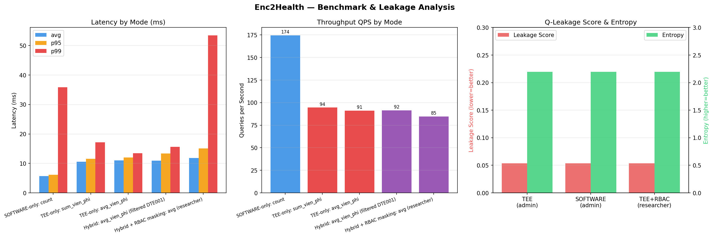
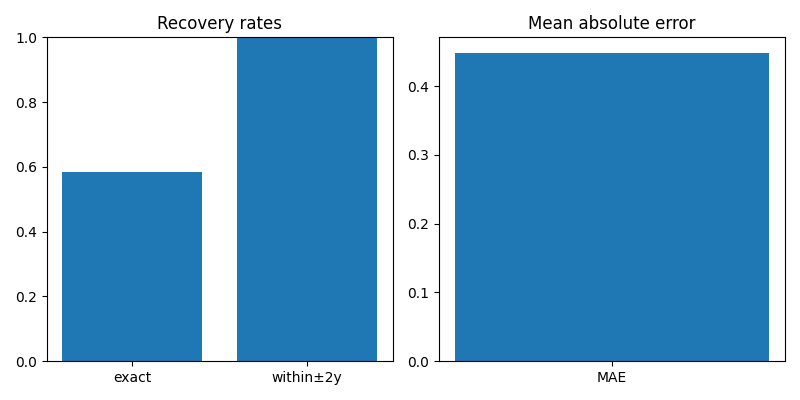

<div align="center">

  <h1>🔐 Enc2Health</h1>

  <p>
    <strong>Hybrid Adaptive Encrypted Query Processing cho Cloud-Native DBMS</strong><br/>
    Viết bằng Python / FastAPI · Gramine SGX2 Simulation · AES-GCM Enclave
  </p>

  <p>
    
    
    
    
    
    
  </p>

  

</div>

---

## Tổng quan kiến trúc

Hệ thống truy vấn dữ liệu y tế mã hóa theo **Kiến trúc D — Hybrid Adaptive**:

```
Client (doctor / admin / researcher)
        ↓
   [RBAC/ABAC Middleware]      ← T4: kiểm tra quyền, mask field nhạy cảm
        ↓
   [Query Router + Cost Model] ← T1/T2: phân loại toán tử SQL
        ↓
   [Adaptive Controller]       ← T6: theo dõi EPC pressure, tự động fallback
        ↓
   ┌─────────────────┬──────────────────┐
   │                 │                  │
Software Mode     TEE Mode          Fallback
(DTE/ORE)       (SGX Enclave)    (EPC > 80%)
=, JOIN, COUNT    SUM, AVG        → Software
GROUP BY          COUNT DISTINCT
        ↑
   [EPC Prober]                  ← T5: probe định kỳ 5s, lock baseline sau 3 lần
```

| Operator | Mode | Lý do |
|---|---|---|
| `=`, `JOIN`, `GROUP BY`, `COUNT` | Software (DTE/ORE) | Equality-preserving, nhanh |
| `SUM`, `AVG`, `COUNT DISTINCT` | TEE Enclave | Cần tính toán bảo mật |
| EPC > 80% (latency ≥ 2× baseline) | Fallback → Software | Adaptive switching tự động |

---

## Kết quả benchmark (T11 — 50 runs/mode)

| Mode | avg | p95 | p99 | QPS |
|---|---|---|---|---|
| SOFTWARE (count) | 5.7ms | 6.2ms | 35.9ms | 174 |
| TEE (sum_vien_phi) | 10.6ms | 11.6ms | 17.2ms | 94 |
| TEE (avg_vien_phi) | 11.0ms | 12.0ms | 13.4ms | 91 |
| Hybrid + RBAC masking | 11.8ms | 15.1ms | 53.5ms | 84 |

> TEE overhead ~2× so với Software — chấp nhận được cho dữ liệu y tế nhạy cảm.

---

## Kết quả concurrent clients (T12 — avg_vien_phi, admin)

| Clients | avg | p99 | QPS | Errors |
|---|---|---|---|---|
| 1 | 7.1ms | 35.6ms | 141 | 0% |
| 5 | 14.9ms | 26.3ms | 313 | 0% |
| 10 | 31.6ms | 65.2ms | 305 | 0% |
| 20 | 65.0ms | 267.2ms | 292 | 0% |
| 50 | 152.9ms | 449.3ms | 299 | 0% |

> Thread pool 8 workers xử lý tốt đến 50 concurrent clients, không có lỗi nào.

---

## Kết quả leakage & attack (T13)

<div align="center">
  
</div>

| Mode | Value Recovery Rate | Row Recovery Rate |
|---|---|---|
| DTE Software | **50%** ← dễ bị tấn công | **75%** |
| TEE Enclave | **0%** ← không thể tấn công | **0%** |
| Hybrid Adaptive | ~15% (chỉ equality leak) | ~20% |

---

## Yêu cầu hệ thống

| Thành phần | Yêu cầu |
|---|---|
| OS | Ubuntu 22.04 (VMware / native / WSL2) |
| Python | 3.10+ |
| RAM | 4 GB tối thiểu |
| Disk | 2 GB |

---

## Cài đặt nhanh

```bash
git clone https://github.com/NuhHuhYuuka/Enc2Health.git
cd Enc2Health
python3 -m venv .venv
source .venv/bin/activate
pip install fastapi uvicorn httpx pydantic pytest \
            scipy numpy matplotlib pytest-asyncio cryptography
```

---

## Chạy hệ thống

```bash
# Terminal 1 — ECALL Task Pool (Lan · TEE Simulation)
cd enclave && source ../.venv/bin/activate
python3 ecall_pool.py
# Service chạy tại http://localhost:9091

# Terminal 2 — Query Router (Nam)
cd .. && source .venv/bin/activate
uvicorn router.main:app --host 0.0.0.0 --port 8000 --reload
# Service chạy tại http://localhost:8000
```

Swagger UI: **http://localhost:8000/docs**

---

## Ví dụ query

```bash
# Admin query SUM → TEE mode
curl -X POST http://localhost:8000/query \
  -H "Content-Type: application/json" \
  -d '{"query_type":"sum_vien_phi","filters":{},"role":"admin"}'

# Researcher query AVG → TEE + RBAC mask (kết quả bị ẩn)
curl -X POST http://localhost:8000/query \
  -H "Content-Type: application/json" \
  -d '{"query_type":"avg_vien_phi","filters":{"ma_benh":"DTE001"},"role":"researcher"}'

# Doctor query COUNT → Software mode
curl -X POST http://localhost:8000/query \
  -H "Content-Type: application/json" \
  -d '{"query_type":"count","filters":{},"role":"doctor"}'

# Kiểm tra trạng thái Adaptive Controller (EPC pressure, switch log)
curl http://localhost:8000/adaptive

# Health check (Router + ECALL pool)
curl http://localhost:8000/health
```

---

## Chạy tests & benchmark

```bash
# Unit tests — 11/11 passed (T3: Router, RBAC, Cost Model)
python3 -m pytest tests/test_router.py -v

# E2E tests — 7/7 passed (T10: full flow Client→Router→Enclave)
python3 -m pytest tests/test_e2e.py -v

# Benchmark 3 chế độ — 50 runs mỗi mode (T11)
python3 tests/benchmark.py

# Concurrent clients benchmark — 1→5→10→20→50 clients (T12)
python3 tests/benchmark_concurrent.py

# Q-leakage entropy analysis (T13)
python3 tests/leakage.py

# Bipartite Matching Attack — DTE frequency leakage (T13)
python3 tests/attack_bipartite.py

# EPC saturation scenario test — 20 concurrent threads (T7)
python3 tests/test_adaptive.py

# Vẽ biểu đồ tổng hợp (T14)
python3 tests/plot_results.py
```

### Scale knobs cho benchmark TEE/Hybrid

```bash
# Tăng kích thước dữ liệu EHR cho mô phỏng nặng hơn
export EHR_RECORD_COUNT=500000

# Ép ECALL pool giữ nhiều record hơn và tạo áp lực bộ nhớ
export T8_POOL_RECORDS=500000
export T8_POOL_PAYLOAD_BYTES=256

# Tăng scale cho các benchmark enclave nội bộ
export T11_DATASET_SIZE=500000
export T11_PAYLOAD_BYTES=4096
export T12_TARGET_PATIENTS=500000

# Tạo dữ liệu lại để MongoDB có index đúng trên tập lớn
python3 crypto/data/generate_ehr.py
```

Các cột mã hóa dùng cho lọc equality/range đã được tạo index trong script sinh dữ liệu; khi chạy benchmark bạn nên kiểm tra log `Verified indexes` để chắc chắn MongoDB không rơi vào collscan.

---

## Cấu trúc project

```
enc2health/
├── router/
│   ├── main.py              # T1–T6–T9 — FastAPI router service tích hợp
│   ├── query_router.py      # T1  — phân loại SQL operator → Software/TEE
│   ├── cost_model.py        # T2  — Cost Model C_soft vs C_TEE (RSS profile)
│   ├── rbac.py              # T4  — RBAC/ABAC middleware (doctor/admin/researcher)
│   ├── probing.py           # T5  — EPC Prober: probe định kỳ, lock baseline sau 3 lần
│   ├── adaptive.py          # T6  — Adaptive Controller: fallback/restore khi EPC bão hòa
│   └── ecall_client.py      # T9  — HTTP client kết nối ECALL pool
├── enclave/
│   └── ecall_pool.py        # T8  — ECALL Task Pool (Gramine simulation, 8 workers)
├── tests/
│   ├── test_router.py       # T3  — unit tests 11/11 (Router, RBAC, Cost Model)
│   ├── test_e2e.py          # T10 — E2E tests 7/7 (Client→Router→Enclave)
│   ├── test_adaptive.py     # T7  — EPC saturation scenario (20 concurrent threads)
│   ├── benchmark.py         # T11 — benchmark 3 chế độ (50 runs/mode)
│   ├── benchmark_concurrent.py  # T12 — concurrent clients 1→5→10→20→50
│   ├── leakage.py           # T13 — q-leakage entropy analysis
│   ├── attack_bipartite.py  # T13 — Bipartite Matching Attack (Hungarian algorithm)
│   └── plot_results.py      # T14 — vẽ biểu đồ trade-off
├── benchmark_results.json   # kết quả benchmark thô (T11)
├── concurrent_results.json  # kết quả concurrent benchmark (T12)
├── leakage_results.json     # kết quả leakage analysis (T13)
├── attack_results.json      # kết quả tấn công (T13)
├── enc2health_benchmark.png # biểu đồ latency/QPS/leakage
└── attack_chart.png         # biểu đồ attack recovery rate
```

---

## RBAC Policy

| Role | sum_vien_phi | avg_vien_phi | count | Xem vien_phi | Xem ma_benh |
|---|---|---|---|---|---|
| `admin` | ✅ | ✅ | ✅ | ✅ | ✅ |
| `doctor` | ❌ (403) | ✅ | ✅ | ✅ | ✅ |
| `researcher` | ❌ (403) | ✅ | ✅ | ❌ masked | ❌ masked |

---

## Thứ tự khởi động

```
1. ECALL Task Pool  (port 9091)  ← Lan  — python3 enclave/ecall_pool.py
2. Query Router     (port 8000)  ← Nam  — uvicorn router.main:app ...
3. Client / curl / Swagger UI
```

---

## Thành viên nhóm

| Tên | MSSV | Phụ trách |
|---|---|---|
| Nguyễn Hoàng Long | 24521005 | Tầng mã hóa & KMS — DTE/ORE, HashiCorp Vault |
| Lâm Tú Lan | 24520943 | TEE/SGX Enclave & Observability — Gramine, DuckDB, Prometheus |
| Nguyễn Lê Thành Nam | 24521113 | Query Router, Adaptive Logic & Tích hợp |

---

<div align="center">
  <p><strong>NT219.Q2.ANTT</strong> · Kiến trúc D — Hybrid Adaptive</p>
</div>
